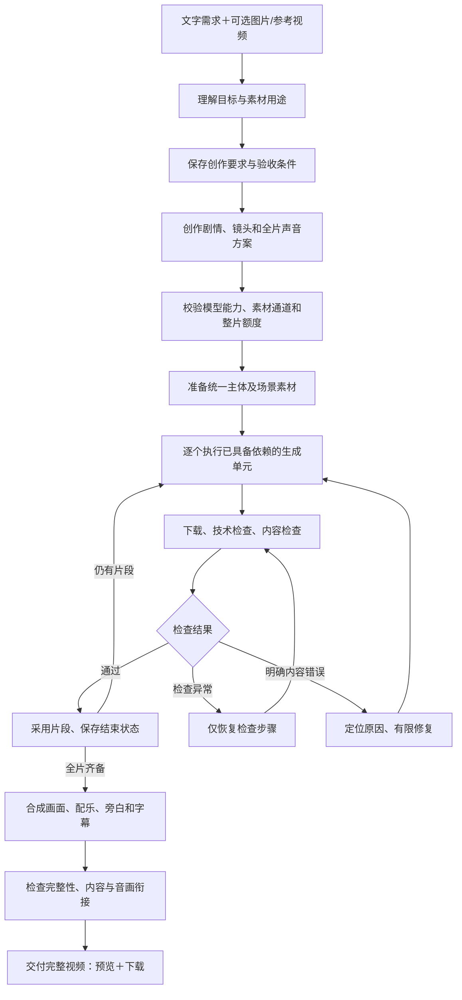

# 面向公司内部完整视频交付的改造方案

日期：2026-09-28

状态：根据现有代码、历史真实任务及本轮隔离核对形成的审查与实施设计，尚未实施本方案，不作为功能完成或稳定性验收证明。本轮未更改业务流程、未重新提交用户任务、未调用收费生成。

## 1. 产品目标与验收对象

用户用自然语言描述需求，图片和参考视频可选。系统自动理解、创作、规划、生成、检查、合成，交付可预览、可下载的完整视频。用户不需要了解提示词、Hypit、FFmpeg、素材地址、生成单元或回执。

新任务的正式产品入口只有四种：文字；文字＋图片；文字＋参考视频；文字＋图片＋参考视频。文字必填，图片最多六张等现有限制在能力验收后确认。历史无文字任务保留可读、可下载，不因收紧新入口而失效。

| 输入 | 系统必须完成的工作 | 不能默认替用户作出的决定 |
| --- | --- | --- |
| 文字 | 创作剧情/展示结构、主体设定、镜头和声音，必要时准备统一主体素材 | 无图就要求用户上传图片；擅自增加商品功能、强制静音 |
| 文字＋图片 | 判定图片中主体、场景、风格的用途，把文字中的新动作和场景落实到视频 | 因图片中没有目标动作而认为无法制作；把所有图片都当商品主体 |
| 文字＋参考视频 | 识别用户借鉴的内容、节奏、风格或镜头，创作满足文字要求的新片 | 强制复制参考全部事件、原角色和时长 |
| 文字＋图片＋参考视频 | 以文字确定目标，使用图片的指定主体及参考视频中需要借鉴的表达 | 有图片就强制替换参考中的所有角色；仅借鉴风格时仍追问替换谁 |

完整交付需要同时满足：所有计划段落已生成并采用、顺序和目标时长正确、文件可完整解码和播放、主体及关键内容符合需求、应有声音和字幕正确、最终版本可访问和下载。单个片段成功、手动拼接部分片段、模型给出 pass，都不能单独证明完整交付。

人物属于用户提出的主体范围。当前“不支持真人”的产品约束与需求不一致；必须通过实际供应商能力测试确认人物图片和参考输入路线，必要时接入能满足需求的适配器。删除界面限制或改变模型提示词不等于实现人物能力。

## 2. 本轮确认的结构性偏差

### A. 产品入口与参考策略没有统一的需求定义

- `app/server.py::NewJob`、`static/index.html` 允许文字为空，界面以“补充要求”和“参考视频复刻”为主。
- `app/intent.py::resolve`：存在参考时默认使用原时长，`reference_mode` 固定为 recreate。
- 隔离核对：输入“只借鉴配色和镜头节奏，做一个10秒新品介绍，不照搬剧情”，参考为30.74秒，返回的目标仍是30.74秒、模式仍是 recreate。这是前置解析层与用户文字冲突，不能声称下游真实生成已测试。
- `app/pipeline.py::PLAN_PROMPT`、`app/unit_planner.py::validate` 强制覆盖参考全部事件和时间区间；`app/agent_tools.py::set_plan`、`app/production.py::prepare_manifest` 又强制每个参考单元提交对应原视频。
- `app/subject_mapping.py::required` 只要有参考＋identity图片就进入角色替换流程，没有先判断用户是否真的要求替换。

影响：只改规划提示词仍会被执行校验拒绝；借鉴风格、缩短时长、改变故事等正常需求会被错误处理。

### B. 没有统一的创作要求和全片资产记录

- 新标准流程 `app/pipeline.py` 直接从素材理解进入计划；生成和不同层级审片分别解释原始文字。
- 旧流程 `app/worker.py` 有 shared_subject 生图路径，工具层也有 generate_subject，但当前新标准流程没有统一主体资产准备阶段。
- 当前主体路径主要来自用户上传图片；无图片的新主体跨独立场景保持身份，缺少专门的全片基准与验证。传前段结束帧有帮助，不能替代全片身份设计。
- 当前连续依赖有哈希与版本校验，应保留；但“同一个人物”和“同一动作连续发生”需要分别表示，不应仅依靠一条前段依赖链表达。

影响：纯文字、多场景人物或商品视频的持续一致性缺少完整实现路径；创作与审查可能使用不同标准。

### C. 全片可执行性检查发生得太晚

- `app/production.py::capabilities` 明确标注 adapter_declared_not_live_verified：这是适配器声明，不是真实输入模式验证。
- `app/store.py::reserve_plan` 按目标成片时长检查额度；实际提交按生成秒数、取整、重试单独预留，两者不能等同。
- `app/agent_tools.py::build` 按单次检查预算；当前缺少对全片首次完成所需生成时长、资产准备、后处理与返修额度的统一估算和预留设计。
- 最新真实任务第一段完成后，第二段返回 insufficient account balance；上层呈现为提交结果不明。保留不明回执是必要保护，但面向用户的原因和管理员处理路径不完整。

影响：开始制作不意味着已具备完成整片的资源；完成一段后才发现后续无法继续。

### D. 恢复、审片、交付尚未形成一致的状态流程

- `retry` 主要重新排队；当前 warn 审片可能直接再次返回 needs_review。本轮之前已通过隔离数据复现，未触发重新审片。
- 审片缺少 evidence 等结构错误会穿透到任务 failed，视频仍在。本轮之前已隔离复现。
- 远端提交、文件下载、审片和内容返修需要不同恢复策略；单个“继续”动作不能表达这些差别。
- 现有采样审片不能保证每帧正确；增加审片次数不应被当作合格率一定提高的证明。
- 合成接口能够接收统一音轨，但标准自动流程没有全片声音规划与制作步骤，默认主要拼接分段自带声音。
- 当前已实现全计划覆盖校验与通过后正式交付的限制，应该保留；部分片段合成需要在界面明确标为局部预览，不能误导为完整成片。

### E. 公司运行条件还未验收

- 当前健康接口只用地址非空判断 reference_ready；提交前探测的是模型 API 地址。
- 本地监督程序不管理公网隧道；监督进程异常退出后的子进程回收不完整。
- 生产配置检查、账号、独立 Worker、PostgreSQL 和部署模板已有代码；不能据此声称公司环境已部署或压测通过。

## 3. 目标流程：先固定需求，再执行可恢复的制作计划

说明：流程仍由程序控制，模型提供结构化的理解、创作与观察结果；Hypit 承担执行、生成资源和渲染。无需把程序控制流程退回让模型自由调用工具，也不需要重写已有执行租约、提交去重、文件校验与预算保护。

### 3.1 统一创作要求

新增持久记录 `creative_brief`，至少包括：

- 用户原文、关键目标、主体与场景、动作/信息顺序、必需文案；
- 图片各自用途：身份、场景、风格、辅助素材；
- 参考用途：借鉴风格/节奏、改编结构、明确复刻，及需要保留与允许改变的部分；
- 时长、画幅、声音、字幕要求；
- 每个硬性要求的用户原文或素材证据来源；允许自动决定的偏好；
- 需求版本及真正无法自行确定的内容问题。

文字中的“10秒”不能被默认参考时长覆盖。表单与文字明确冲突时提出简短内容问题；自动选项不是另一个明确指令。未指定时长时按表达需要选择，只有明确要求跟随参考才锁定原时长。

普通用户无需选择底层参考模式。系统从文字判断；“借鉴一下”默认创作改编，“逐镜复刻/动作保持一致”才采用严格参考约束。身份对应和创作目标冲突才追问，镜头术语、分段长度、模型调用方式由系统处理。

这一记录必须同时约束：导演计划、执行校验、生成提示词、片段审查、整片审查。不能只在提示词里说明，而在校验层仍强制旧策略。

### 3.2 参考的观察事实与采用要求分开

保留 `reference_analysis` 作为对原视频的观察。新增采用记录，描述哪些风格、镜头、动作或故事结构服务于本次目标，哪些明确不采用及原因。

- 风格借鉴：无需强制提交每段原片，不要求覆盖所有事件，也不必理解与目标无关的每一段声音。
- 结构改编：保留需要的叙事关系，可增删事件、调整顺序与时长，检查是否满足用户要求。
- 明确复刻：才执行原事件映射、对应区间、覆盖和替换校验。
- 无参考：直接创作，不运行参考分析和公网视频通道要求。

生成模型是否直接接收原参考片段，由采用策略和已验证能力决定，不能只由“上传了视频”决定。引用到的事实仍须真实观察，不能为减少分析而假装已经理解未读的内容。

### 3.3 主体、故事和声音按整片组织

- 先形成完整表达结构，包括开场、主体内容、结尾，避免模型只返回若干互不相干的片段。
- 对复用的主体建立固定身份描述及真实可用的参考素材。纯文字多段视频可由系统生成并检查统一主体图，也可采用已验收首段中的清晰身份基准；选择哪条路线须有能力和质量验证。
- 身份依赖和动作连续依赖分别记录。新场景仍使用同一身份基准；连续动作使用前段已采用结束画面和状态。独立场景在资源允许时可并行，存在动作依赖的部分顺序执行。
- 每段有主体状态、动作目的、开始/结束状态和声音意图。片段过多会增加成本和衔接风险，分段需结合模型有效时长及动作复杂度。
- 全片规划背景音乐、旁白、字幕与环境声。准确文案适合后期字幕/旁白实现；配乐需使用可供公司使用的素材。不能假定视频模型一次就能准确生成所有文字和语音。
- 自动合成负责时长、画幅、音量、音画同步及衔接。仅在可验证不损伤内容时采用裁剪或淡入淡出，不能用转场掩盖缺失动作。

### 3.4 提交前检查“整片能否完成”

在第一笔生成之前检查：

1. 模型的实际能力是否覆盖所需输入、主体类型、时长、参考和帧组合；不支持时在创作要求不变的前提下调整实现路线。
2. 全计划生成秒数按真实最小时长和取整计算，包含身份素材、必要后处理及有上限的返修额度。公司额度预留需事务保护，多个用户不能争用同一余额。
3. 服务商余额仅在有可靠接口时自动检查；没有接口就明确为未知，由管理员配置保守额度与余额告警，不能伪造“已确保足够”。本地额度不等于供应商实际余额。
4. 本次真正要交给模型的签名素材可下载，有足够有效期，内容匹配；固定域名/持久存储的保留时间覆盖排队、执行和恢复。
5. 渲染运行环境、存储空间、下载及最终预览链路可用。

前置检查只能降低风险，不能保证后续不掉网、不限流或共享账户余额不变化，因此执行期仍要有恢复策略。

### 3.5 用阶段记录恢复，区分再次检查和再次收费

在已有任务记录、manifest、提交日志和版本校验上补齐阶段记录：输入版本、输出引用、完成状态、尝试次数、失败类型、服务商任务编号、下次执行时间和处理责任。

| 情况 | 系统动作 | 用户需要做什么 |
| --- | --- | --- |
| 理解/审片读取暂时失败 | 有上限退避重试当前步骤，复用已验证结果 | 通常无需操作 |
| 审片JSON不合规 | 保存异常返回，有限格式纠正；不因格式问题重新生成视频 | 仍无法判断时提示复核状态 |
| 生成请求已受理、查询掉线 | 查询原任务号，成功后继续下载 | 通常无需操作 |
| 生成成功、下载失败 | 重试下载/恢复结果地址，验证文件后继续 | 通常无需操作 |
| 已确认未受理或终态失败 | 按明确策略决定是否创建新的尝试，有新ID、关联前次原因并计入额度 | 超额度前才需要选择是否继续 |
| 提交结果不明 | 对账原请求，不盲目再次提交 | 管理员处理；普通用户看到清楚状态 |
| 余额不足/认证/素材通道故障 | 暂停相应生成、保留进度，管理员处理后从必要步骤恢复 | 不要求普通用户处理API、域名或回执 |
| 内容明确不符合硬性要求 | 定位到单元和原因，改变相关生成条件后有限修复 | 不要求用户编写专业提示词 |
| 次数/额度耗尽 | 说明未满足的内容，保留预览和已完成部分，不标完整交付 | 可调整内容或由管理员批准更多额度 |

错误原因和提交是否确定是两个不同字段。余额不足错误可以展示给管理员，但 HTTP 500 加错误文案并不足以自动证明从未受理；对账证据不足时仍保留不重复提交保护。

重试同一请求的幂等标识保持不变；已经证明可以重新生成时创建明确的新尝试。签名URL和临时域名不应成为逻辑请求身份，不得靠改URL或改提示词绕过去重。

### 3.6 审片结果服务于完整交付

- 技术检查：实际文件存在、哈希、时长/画幅、完整解码、音轨及同步。
- 内容检查：对照固定创作要求，逐项引用实际画面/声音证据；区分硬性不符、可接受的表现差异、证据不足。
- 不把主观偏好当成用户的硬性要求，不把模型声称“所有要求满足”当作事实证明。
- 有疑点时先重看对应区间；格式错误先修审片；真实视觉问题才修片段；声音和字幕问题优先后处理；过于复杂的方案要回到规划修正，而非无限重复同一提示词。
- 返修范围按依赖传播：修改片段后只作废实际使用其旧版本的后续结果，独立场景保留。旧版素材和费用证据不删除。
- 合成成功和内容通过分别记录。全片已生成但复核未完成可以预览，不能伪装为正式完成；只有部分片段时显示“已完成1/6段，完整视频尚未完成”。

### 3.7 公司部署与用户界面

固定服务主机、持久素材地址、公司账号和权限、数据库/素材备份、独立Worker及服务管理统一实施。现有生产门禁和部署模板作为起点，现场执行渲染、恢复、权限和负载验证。

员工页面：描述需求 → 可选素材 → 提交 → 查看制作进度 → 完整视频预览/下载。必要追问只涉及内容。分段和版本作为可展开详情，主入口不要求用户自己选片、拼接或核对服务商。

管理员页面：服务健康、供应商余额/额度状态、需处理异常、历史尝试、恢复入口。管理员操作也应有身份、状态校验和审计记录，避免依赖修改数据库。

## 4. 实施顺序与代码落点

不是同时重写全部系统。按以下顺序建立一条可验证的主链路；每步使用同一组目标用例。

| 顺序 | 改动 | 主要位置 | 该步完成证据 |
| --- | --- | --- | --- |
| 1 | 四种入口、统一创作要求和参考采用策略 | server / intent / subject_spec / subject_mapping / 新brief模块 | 四种输入产生正确需求；“10秒＋30秒参考”“只借鉴风格”“人物主体”不再被旧规则改写 |
| 2 | 将同一策略贯穿规划、校验、生成和审查 | pipeline / unit_planner / production / workflows / unit_review / agent_tools | 允许合法改编；明确复刻仍有覆盖校验；同一要求贯穿全程 |
| 3 | 整片能力、素材、预算预检，主体和声音准备 | production / image_asset / compiler / store / provider adapter | 不支持的方案在付费前发现；跨场景身份及声音有可追溯方案 |
| 4 | 阶段恢复和有限返修 | pipeline / recovery / errors / store / execution | 断网/重启只恢复必要步骤；回执不明不重复生成；成功片段不丢失 |
| 5 | 完整交付界面和管理员处理闭环 | server / static / runtime / deployment | 员工无需操作技术按钮拿到成片；异常准确说明原因、进度和责任 |
| 6 | 固定版本真实验收、公司环境试运行 | tests / acceptance / deployment | 四种组合完整成片、质量记录、费用与耗时数据、故障恢复和持续运行报告 |

新流程使用明确的新版本。历史任务保留原计划、适配器快照、回执和成片，不在升级时静默改变在途任务语义。正在运行的任务由旧流程完成或明确暂停；升级、迁移与回退都需要保留完整提交记录。

## 5. 验收：以真实完整成片为单位

### 不收费的代码与故障验证

- 四种输入合法；新入口无文字拒绝；历史无文字任务仍可查看。
- 表单自动＋文字时长生效；表单与文字冲突走内容澄清；参考时长不覆盖明确文字。
- 风格借鉴无需覆盖原剧情；明确复刻必须覆盖要求的事件。
- 纯文字无素材也能进入完整创作流程；统一主体准备有稳定版本及去重。
- 有余额/参数/认证问题时错误归类正确；不明受理状态不能被重试按钮绕过。
- 在提交、回执保存、下载、审片、合成各阶段注入中断，恢复后不重复生成、不丢成果、不误报完成。
- 审片格式异常、声音检查失败、采样证据不足不会直接触发付费返修。
- 全片少一段不能完成；分段成功不等于整片成功；下载URL及权限正确。

### 真实能力与成片验收

先验证供应商的文字、图片、视频、多素材及人物能力，再固定适配器与应用版本执行完整测试。不能用接收请求成功代替能力通过；无法稳定表达的能力需要换路线或换模型并重新验收。

四组输入各准备不同内容样例，覆盖短单段与30—60秒多段、商品与人物、不同画幅、声音需求、明确改编与明确复刻。先小批验证后扩大样本，按真实调用成本制定批次预算，不在余额问题未解决时盲目提交。

每条记录保留：需求、素材哈希、应用/模型版本、计划、全部尝试和服务商回执、采用片段、最终文件、首次/返修后质量结论、人工评审、耗时和实际费用。内容质量要独立看实际视频，不能仅抄自动审片结论。

核心指标：

- 首次完整成片率；有限返修后的合格交付率；
- 无需管理员介入的交付率；
- 按输入组合、时长分组的耗时及费用；
- 意外重复提交数、成果丢失数、错误完成数；
- 主体身份、动作/信息、参考采用、音画衔接及完整性的人评结果。

验收必须报告分母和失败原因。一次成功或少量样本不能证明长期稳定；公司试运行还需重启/断网、多人权限与并发、备份恢复及持续运行验证。通过标准和测试预算在真实批次执行前固定，不能看到结果后降低标准。

## 6. 能解决的范围和仍需外部条件

这套设计直接处理当前偏差的来源：把需求贯穿全流程、将可完成性检查前移、用明确状态恢复、把质量问题定位到正确步骤、以完整交付评价结果。前面四个稳定性问题是其中的实现项。

代码可以保证正确的状态转换、去重、保留成果和按条件恢复；不能保证每个外部模型请求都成功、任意复杂动作一次生成正确或账户永远有余额。对此必须通过能力选择、有限修复、服务监控和真实验收建立可测量的交付能力。

当前需要解决的外部条件包括供应商余额/受理记录、持久素材访问、公司部署环境和真实验收费用。它们由管理员处理，不转嫁给普通制作用户。未完成实施及上述验证前，不把方案写成“已达到公司稳定使用”。
